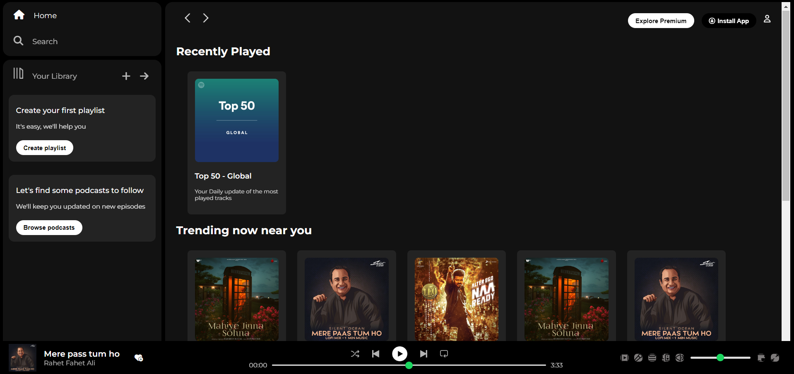

# Spotify Clone: Learning HTML and CSS by Building a Spotify Replica

Welcome to the Spotify Clone repository! This project is designed for learning purposes, where we use HTML and CSS to recreate the user interface of Spotify, one of the leading music streaming platforms.

## Project Overview

The Spotify Clone project aims to provide a hands-on learning experience in HTML and CSS by replicating the visual appearance and layout of the Spotify web application. Through this project, you'll gain practical experience in building responsive and visually appealing web pages using modern web development techniques.

## Key Features

- **HTML Structure:** Learn how to structure web pages using HTML elements to create a foundation for building the Spotify interface.
- **CSS Styling:** Explore CSS styling techniques to design and customize the appearance of various UI components such as navigation bars, playlists, album covers, and more.
- **Interactive Elements:** Enhance the user experience by adding interactive elements such as buttons, hover effects, and animations to mimic the behavior of the Spotify interface.

## Spotify Landing Page Sample

## Getting Started

To begin your journey into building a Spotify Clone, simply clone or download this repository and open the project files in your preferred code editor. The project structure is organized with HTML and CSS files, along with any necessary assets such as images.

Let's dive into building a Spotify Clone and hone our HTML and CSS skills while creating a visually stunning replica of a popular music streaming platform!

Happy coding! 🎶